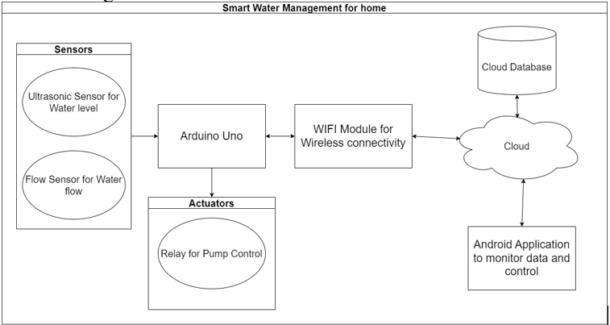
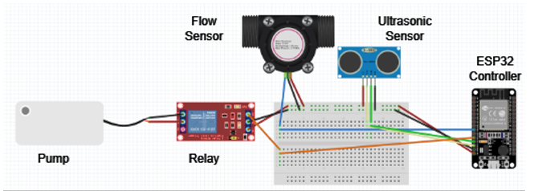
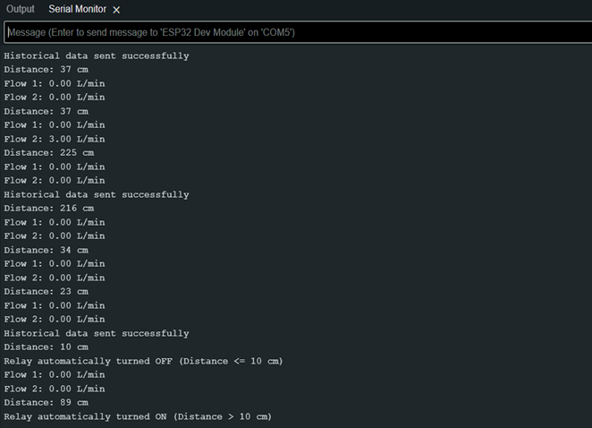
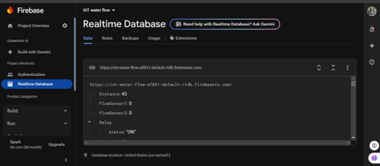

# Smart Water Management System for Home

An IoT + Android project that monitors **water level** (ultrasonic) and **pipeline flow** (YF-S201), controls a **pump** via relay, stores telemetry in **Firebase Realtime Database**, and visualizes usage trends on an **Android app**.

> ⚠️ **Note**: This project is an educational prototype. Use at your own risk and follow electrical/water safety practices.

---

## ✨ Features
- **ESP32** reads **HC‑SR04** water level and **YF‑S201** flow sensors
- Automatic **pump control** via relay based on tank level thresholds
- **Firebase Realtime Database** for live + historical data
- **Android app** for dashboards (flow graphs, timestamps, relay state)
- Modular design for easy expansion (quality sensors, alerts, etc.)

## 📦 Repository Structure
```
.
├─ app/                         # Android app module (add your code)
├─ firmware/                    # ESP32 Arduino sketch (add your code)
├─ docs/
│  ├─ Project-Report.pdf        # Export your report here
│  ├─ IOT-board.fzz             # Fritzing wiring file (added here)
│  └─ images/                   # Screenshots & diagrams
│     ├─ architecture.png
│     ├─ hardware.png
│     ├─ arduino_serial.png
│     ├─ firebase_db.png
│     └─ android_graph.png
├─ .gitignore
├─ README.md
├─ requirements.md
├─ LICENSE
└─ HOWTO_UPLOAD.md
```

## 🛠 Hardware
- **ESP32 (WROOM‑32)**
- **HC‑SR04** Ultrasonic sensor (tank level)
- **YF‑S201** Flow sensors ×(1..2) for pipelines
- **5V Relay module** (pump control), **Pump/Motor**
- Wires, breadboard, switches, power supply

## 🧰 Software Stack
- **Arduino IDE** for ESP32 (Wi‑Fi + sensors + Firebase client)
- **Firebase Realtime Database**
- **Android App** (Kotlin/Java) for charts & controls

## 🧭 Architecture


### Data Flow
1. ESP32 samples sensors (distance, flow)  
2. Publishes live data to Firebase (and appends historical rows)  
3. Relay toggled automatically by level thresholds; app can override  
4. Android app shows real‑time and historical charts

## 🔌 Wiring & Firmware
- Open the **Fritzing** file: `docs/IOT-board.fzz`  
- Put your Arduino sketch under `firmware/` with:
  - Wi‑Fi credentials
  - Firebase project keys
  - GPIO pins for HC‑SR04 (TRIG/ECHO), flow sensor(s), relay
  - Thresholds for pump ON/OFF

## ☁️ Firebase Structure (example)
```
/smartwater/
  current/
    timestamp: 1732046512
    distance_cm: 42
    flow1_lpm: 12.3
    flow2_lpm: 0.0
    relay: "ON"
  history/
    {{timestamp}}/
      distance_cm: ...
      flow1_lpm: ...
      flow2_lpm: ...
      relay: "ON"
```
*(Adjust to your app’s actual paths.)*

## 📱 Android App
- Realtime dashboard, flow graphs, timestamps, relay state
- Suggested libs: MPAndroidChart (or Jetpack Compose charts), Firebase SDK
- Typical flow graph:


## 🖥️ Screens & Logs
- Hardware setup:  
  
- Arduino IDE Serial:  
  
- Firebase RTDB:
  

## 🔐 Secrets & Safety
- **DO NOT COMMIT**: `local.properties`, API keys, service accounts, keystores (`*.jks`/`*.keystore`)
- Mains safety: relay + pump must be isolated and fused appropriately

## 🚀 Getting Started
### Firmware
1. Install ESP32 board support in Arduino IDE
2. Install Firebase client lib for ESP32
3. Configure pins/thresholds, Wi‑Fi, Firebase creds
4. Upload to ESP32 and check serial output

### Android
1. Open `app/` in Android Studio → Gradle sync
2. Add Firebase dependencies and `google-services.json` (don’t commit)
3. Implement DB listeners, charts, and UI

## 🧪 Useful Commands
```bash
# Build Android debug APK
./gradlew assembleDebug

# ESP32 monitor (if using Arduino CLI / platformio - optional)
# arduino-cli monitor -p /dev/ttyUSB0 -c 115200
```

## 👥 Authors
- Nithishkumar R — 21MIS1075
- Aswin Mallesh N S — 21MIS1087

## 🛡 License
MIT — see [LICENSE](LICENSE).

---

> Replace the placeholders in `docs/images/` with your real screenshots/diagrams and commit.
